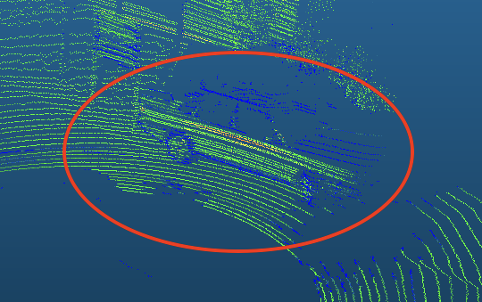
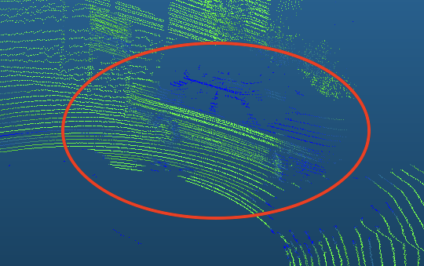

# LiDAR Intensity Regression Pipeline

This extension of the Cylinder3D architecture implements a regression pipeline for predicting LiDAR point intensity values from geometric features. Unlike the semantic segmentation task that classifies points into discrete categories, this regression model predicts continuous intensity values.

<div style="display: flex; justify-content: space-between;">
  <figure style="width: 50%;">
    
    <figcaption>Intensity of a real car from SemanticKITTI</figcaption>
  </figure>
  <figure style="width: 50%;">
    
    <figcaption>Intensity predictions generated with our method</figcaption>
  </figure>
</div>

## Overview

The regression pipeline adapts the original Cylinder3D architecture to predict intensity values instead of semantic classes. This is useful for:

1. Intensity completion in sparse LiDAR data
2. Intensity estimation from geometry-only point clouds
3. Denoising of intensity values in LiDAR scans

## Usage

### Training

To train the regression model:

```bash
python train_cyl_sem.py -r -d cuda:0 -l huber -lr 1e-3 -t tensorboard_logs/regression
```

Parameters:
- `-r`: Activates the regression pipeline
- `-d`: Specifies the device (CUDA GPU)
- `-l`: Loss function (options: mse, mae, huber, weighted_combined, dynamic_combined, switching, custom_combined)
- `-lr`: Learning rate
- `-t`: Tensorboard logging directory
- `-lb`: Use semantic labels as additional input (default: True)
- `--load_model`: Load a pre-trained model if available (default: True)

### Inference

The model can be used to predict intensity values for point clouds with the following command:

```bash
python test_cyl_synlidar_tta.py -r -d cuda:0 -m path/to/model.pt -lb -c -v 4 -o /path/to/output
```

Parameters:
- `-r`: Activates the regression pipeline
- `-d`: Specifies the device (CUDA GPU)
- `-m`: Path to the trained model file
- `-lb`: Use semantic labels as additional input (default: True)
- `-c`: Calculate metrics after inference (default: True)
- `-v`: Voting number for test-time augmentation (default: 4)
- `-o`: Output directory for predicted intensities
- `-n`: Number of samples to save (-1 for no limit)
- `-s`: Keep directory structure of the original dataset (default: True)

The inference pipeline supports test-time augmentation (TTA) to improve prediction quality by averaging results from multiple augmented versions of the input. Predictions are saved as binary files with the `.ref` extension, representing the predicted intensity values for each point in the original point cloud.

### Evaluation Metrics

The regression pipeline tracks multiple metrics:
- MSE (Mean Squared Error)
- MAE (Mean Absolute Error)
- RMSE (Root Mean Squared Error)
- R² (Coefficient of Determination)
- MAPE (Mean Absolute Percentage Error)

Models are automatically saved when metrics improve.

## Loss Functions

Seven loss functions are available for training:

1. **MSE**: Standard Mean Squared Error (implemented using `torch.nn.MSELoss()`)
   - Aliases: "mse", "squared", "mean_squared", "mean_squared_error"

2. **MAE**: Mean Absolute Error (implemented using `torch.nn.L1Loss()`)
   - Aliases: "mae", "absolute", "mean_absolute", "mean_absolute_error"

3. **Huber**: Combination of MSE and MAE for robustness to outliers (implemented using `torch.nn.SmoothL1Loss()`)
   - Aliases: "huber", "smooth", "smoothl1", "huberloss", etc.

4. **Weighted Combined Loss**: Custom implementation that combines multiple loss terms with fixed weights
   - Aliases: "weighted_combined", "weighted", "w", "wc"

5. **Dynamic Combined Loss**: Adaptively adjusts weights between loss terms during training
   - Aliases: "dynamic_combined", "dynamic_weighted", "dc", "dwc"

6. **Switching Loss**: Switches between different loss functions depending on the labels
   - Aliases: "switching", "switching_loss", "s", "sl"

7. **Custom Combined Loss**: A customizable combined loss function
   - Aliases: "custom_combined", "custom", "cc", "c"

## Model Input/Output

### Input
- Point-wise features (x, y, z coordinates plus additional geometric features)
- Point grid indices in cylindrical voxel representation
- Optionally, semantic class labels as additional input

### Output
- Intensity values predicted for each point

## Data Flow

1. Point cloud data is loaded and preprocessed
2. Points are mapped to a cylindrical voxel grid
3. The model processes both point and voxel features
4. Intensity values are predicted for each point/voxel
5. Loss is calculated between predicted and ground truth intensities

## Implementation Details

The regression pipeline modifies the original Cylinder3D architecture by:
1. Changing the output layer to predict a single continuous value per point
2. Implementing regression-specific loss functions
3. Using regression metrics instead of classification metrics
4. Adding tensorboard visualization for intensity distributions

## Results Visualization

Training and validation metrics are logged to TensorBoard, including:
- Loss curves
- Histograms of predicted vs. ground truth intensities
- Metric trends over epochs

## Requirements

Same as the main repository, with additional requirements for TensorBoard visualization.


